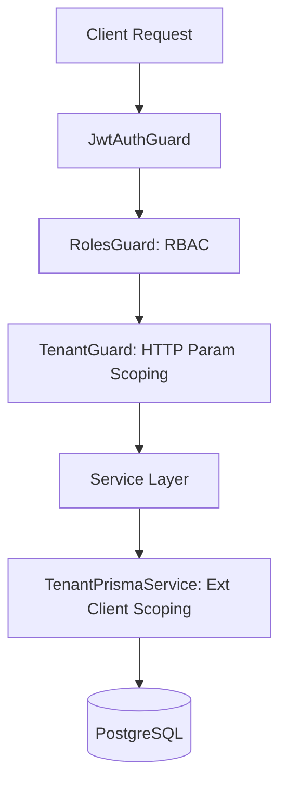

# Scannel Safety Service — Project Master Plan & Reference Blueprint

This document serves as the **Master Project Blueprint and Status Reference** for the Scannel Safety Service application. It details the implemented multi-tenant architecture, security layers, database schema models, API routing structures, and guidelines for developing future features.

---

## 1. Project Overview & Multi-Tenant Model

The Scannel Safety Service is a multi-tenant compliance web application designed for Managing Safety Documents, Categories, Individuals (dependents), and Reminders. It separates resources based on roles and company context.

### Architectural Core Decisions
*   **Tenancy Model**: Shared database, shared schema, discriminator column. All tenant-specific data is separated using a `companyId` foreign key.
*   **Framework**: NestJS (v11) with Fast/Express adapter, modular dependency injection, and global guard/interceptor pipelines.
*   **ORM / Database**: PostgreSQL + Prisma Client (v7) with Prisma Client Extensions for automated query scoping.
*   **Aesthetics & Usability**: Responsive multi-role interfaces, clean, consistent compliance category groupings, and modern file uploads.

---

## 2. Multi-Layer Security & Isolation Stack

Data security and isolation are enforced in two independent layers (defense-in-depth):



### Layer 1: HTTP Boundary Protection (Guards)
1.  **`JwtAuthGuard`**: Applied globally. Validates incoming JWT access tokens. Routes can bypass this guard by using the `@Public()` decorator.
2.  **`RolesGuard`**: Checks route-level metadata set via the `@Roles(...)` decorator to restrict access by role:
    *   `SUPER_ADMIN`: Global access across companies.
    *   `COMPANY_ADMIN`: Administrative rights restricted to their own company.
    *   `COMPANY_USER`: Standard employee credentials with read/write access.
    *   `APP_USER`: Restricted mobile/app client view access.
3.  **`TenantGuard`**: Dynamically verifies that any `companyId` present in route parameters matches the authenticated caller's token payload (unless bypassed by `SUPER_ADMIN`).

### Layer 2: Automatic DB Scoping (Prisma Client Extension)
Instead of relying on developers to explicitly specify `where: { companyId }` in every DB operation, the application intercepts operations via a custom request-scoped provider:
*   [TenantPrismaService](file:///f:/Projects/scannel-safety-service/backend/src/prisma/tenant-prisma.service.ts): Extends `PrismaClient` to automatically inject the user's `companyId` into Prisma query arguments for all models registered in `TENANT_SCOPED_MODELS` (e.g., `findMany`, `findFirst`, `findUnique`, `findUniqueOrThrow`, `count`, `aggregate`, `groupBy`, `update`, `updateMany`, `delete`, `deleteMany`, `upsert`).
*   **Auto-Scoping Bypass**: `SUPER_ADMIN` operations bypass this extension and have direct global access to the database.

---

## 3. Database Schema Blueprint (Prisma)

The [schema.prisma](file:///f:/Projects/scannel-safety-service/backend/prisma/schema.prisma) file defines the following models:

### Tenant & Session Models
*   **`Company`**: Represents the tenant organization. All scoped records cascade-delete or map back to a company.
*   **`User`**: Account profiles belonging to a `Company` (except global `SUPER_ADMIN`). Includes `userCode` (unique per-company user identifier), credentials, and status trackers.
*   **`RefreshToken`**: Session tracking tokens. Raw tokens are never stored at rest; instead, their SHA-256 hashes are verified, rotated on use, and invalidated on logout or password reset.
*   **`PasswordResetToken` / `InvitationToken`**: Single-use, time-boxed token hashes used for reset links and welcome invitations.
*   **`ImpersonationLog`**: Traceable IP-logged history of Super Admins impersonating company accounts.

### Compliance Models (Scoped)
*   **`Category`**: Custom compliance groupings linked to one of 6 fixed `DocumentSection` slots. Supports assigning to specific users (via `CategoryUser`) or setting `assignToAll` flag.
*   **`CategoryUser`**: Junction mapping for many-to-many user-specific category assignments.
*   **`Document`**: Dynamic uploads containing file paths (`fileUrl`), metadata, optional category associations, and optional individual assignments.
*   **`StandardDocument`**: Global read-only document templates (no `companyId`) managed by `SUPER_ADMIN` to act as form blueprints for users.
*   **`Individual`**: Dependents, subcontractors, or sub-profiles managed under a client company user.
*   **`Reminder`**: Compliance alarms with due dates, linked to either a primary user or an individual subcontractor.

---

## 4. Completed Feature & Endpoint Status Matrix

The backend code has been analyzed and is fully implemented. Here is the operational endpoint status mapping:

### 4.1. Authentication (`/auth` & `/admin`)
*   **`POST /auth/login`** (`Public`): Verifies email and password using bcrypt. Returns access and refresh tokens.
*   **`POST /auth/register`** (`SUPER_ADMIN`, `COMPANY_ADMIN`): Creates a new user profile.
*   **`POST /auth/refresh`** (`Public`, uses `jwt-refresh` guard): Validates and rotates refresh token hashes.
*   **`POST /auth/logout`** (`Authenticated`): Revokes and deletes the current session token in the database.
*   **`POST /auth/forgot-password`** (`Public`): Generates single-use reset token hash, handles anti-enumeration (always returns success status code).
*   **`POST /auth/reset-password`** (`Public`): Verifies reset hash, updates password, and revokes all active session refresh tokens.
*   **`POST /auth/accept-invitation`** (`Public`): Allows invited users to finalize setup and define passwords.
*   **`POST /admin/users/:id/impersonate`** (`SUPER_ADMIN`): Generates a short-lived (20 min) non-refreshable access token containing the target user's identity plus an audit token `impersonatedBy`.
*   **`POST /admin/impersonate/stop`** (`Authenticated`): Clears and stops the impersonation session.

### 4.2. Companies (`/companies`)
*   **`POST /companies`** (`SUPER_ADMIN`): Creates a new tenant company.
*   **`GET /companies`** (`SUPER_ADMIN`): Lists all active company tenants.
*   **`GET /companies/:id`** (`SUPER_ADMIN`, matching `COMPANY_ADMIN`): Details a specific company.
*   **`PATCH /companies/:id`** (`SUPER_ADMIN`, matching `COMPANY_ADMIN`): Updates name or status flags.

### 4.3. Users (`/users`)
*   **`GET /users`** (`SUPER_ADMIN`, `COMPANY_ADMIN`, `COMPANY_USER`): Lists and filters company users. Filters support `name`, `userCode`, `email`.
*   **`GET /users/:id`** (`Authenticated`): Scoped user detail lookup.
*   **`PATCH /users/:id`** (`SUPER_ADMIN`, `COMPANY_ADMIN`): Updates profiles, user codes, and roles.
*   **`PATCH /users/:id/archive`** (`SUPER_ADMIN`, `COMPANY_ADMIN`): Reversibly soft-archives a user account (sets `archivedAt`).
*   **`PATCH /users/:id/restore`** (`SUPER_ADMIN`, `COMPANY_ADMIN`): Restores soft-archived user.
*   **`DELETE /users/:id/permanent`** (`SUPER_ADMIN`, `COMPANY_ADMIN`): Irreversibly deletes user records from database (must be archived first).
*   **`POST /users/:id/send-welcome-email`** (`SUPER_ADMIN`, `COMPANY_ADMIN`): Triggers welcome/invitation email link generation.

### 4.4. Categories (`/categories`)
*   **`POST /categories`** (`SUPER_ADMIN`, `COMPANY_ADMIN`): Creates a category under one of 6 fixed sections. Can be flagged as `assignToAll` or mapped to specific users.
*   **`GET /categories`** (`Authenticated`): Scoped list of categories. Non-admins only see categories assigned to them or flagged as company-wide.
*   **`GET /categories/:id`** (`Authenticated`): Details of a category (scoping applied).
*   **`PATCH /categories/:id`** (`SUPER_ADMIN`, `COMPANY_ADMIN`): Edits category details and user assignments.
*   **`PATCH /categories/:id/archive`** (`SUPER_ADMIN`, `COMPANY_ADMIN`): Reversibly soft-archives a category.
*   **`PATCH /categories/:id/restore`** (`SUPER_ADMIN`, `COMPANY_ADMIN`): Restores an archived category.
*   **`DELETE /categories/:id/permanent`** (`SUPER_ADMIN`, `COMPANY_ADMIN`): Permanently deletes category from the database (must be archived first).

### 4.5. Documents (`/documents`)
*   **`POST /documents`** (`SUPER_ADMIN`, `COMPANY_ADMIN`): Uploads a physical file (managed via Express Multer) and saves metadata. Files are saved in local directory `uploads/` and mapped to a web path.
*   **`GET /documents`** (`Authenticated`): Scoped query of files. Non-admins only see records specifically assigned to their `userId` or company-wide categories.
*   **`GET /documents/:id`** (`Authenticated`): Retrieves file detail metadata and verification states.
*   **`PATCH /documents/:id`** (`SUPER_ADMIN`, `COMPANY_ADMIN`): Updates review state (`isReviewed`, `reviewedAt`), labels, categories, or swaps the physical file on disk.
*   **`PATCH /documents/:id/archive`** (`SUPER_ADMIN`, `COMPANY_ADMIN`): Soft-archives a document.
*   **`PATCH /documents/:id/restore`** (`SUPER_ADMIN`, `COMPANY_ADMIN`): Restores archived document.
*   **`DELETE /documents/:id/permanent`** (`SUPER_ADMIN`, `COMPANY_ADMIN`): Deletes record and removes file from disk storage (must be archived first).

### 4.6. Standard Documents (`/standard-documents`)
*   **`POST /standard-documents`** (`SUPER_ADMIN`): Uploads global form templates.
*   **`GET /standard-documents`** (`Authenticated`): Read-only view of global templates for company users.
*   **`GET /standard-documents/:id`** (`Authenticated`): Details of a global template.
*   **`PATCH /standard-documents/:id`** (`SUPER_ADMIN`): Swaps template files or description copy.
*   **`PATCH /standard-documents/:id/archive`** (`SUPER_ADMIN`): Soft-archives templates.
*   **`PATCH /standard-documents/:id/restore`** (`SUPER_ADMIN`): Restores soft-archived template.
*   **`DELETE /standard-documents/:id/permanent`** (`SUPER_ADMIN`): Permanently removes template and its file from disk.

### 4.7. Individuals (`/individuals`)
*   **`POST /individuals`** (`SUPER_ADMIN`, `COMPANY_ADMIN`): Adds a subcontractor or dependent linked to a primary company user.
*   **`GET /individuals`** (`Authenticated`): Lists company sub-records.
*   **`GET /individuals/:id`** (`Authenticated`): Scoped lookup of individuals.
*   **`PATCH /individuals/:id`** (`SUPER_ADMIN`, `COMPANY_ADMIN`): Updates profile details.
*   **`PATCH /individuals/:id/archive`** (`SUPER_ADMIN`, `COMPANY_ADMIN`): Soft-archives individual record.
*   **`PATCH /individuals/:id/restore`** (`SUPER_ADMIN`, `COMPANY_ADMIN`): Restores individual record.
*   **`DELETE /individuals/:id/permanent`** (`SUPER_ADMIN`, `COMPANY_ADMIN`): Permanently deletes individual.

### 4.8. Reminders (`/reminders`)
*   **`POST /reminders`** (`SUPER_ADMIN`, `COMPANY_ADMIN`): Sets due dates and actions assigned to a user or subcontractor individual.
*   **`GET /reminders`** (`Authenticated`): Lists and filters reminders (scoping enforced).
*   **`GET /reminders/:id`** (`Authenticated`): Details of a reminder.
*   **`PATCH /reminders/:id`** (`SUPER_ADMIN`, `COMPANY_ADMIN`): Updates text or due date.
*   **`PATCH /reminders/:id/complete`** (`SUPER_ADMIN`, `COMPANY_ADMIN`): Sets `completedAt` status timestamp.
*   **`PATCH /reminders/:id/archive`** (`SUPER_ADMIN`, `COMPANY_ADMIN`): Soft-archives reminder.
*   **`PATCH /reminders/:id/restore`** (`SUPER_ADMIN`, `COMPANY_ADMIN`): Restores archived reminder.
*   **`DELETE /reminders/:id/permanent`** (`SUPER_ADMIN`, `COMPANY_ADMIN`): Permanently deletes reminder.

---

## 5. Global Compliance & Predefined Document Sections

All categories, documents, and standard documents categorize resources under 6 predefined `DocumentSection` enum slots:
1.  **`SAFETY_STATEMENT`**: Main company statement documentation.
2.  **`COMPANY_DOCUMENTS`**: Generic files and insurance records.
3.  **`RISK_ASSESSMENT`**: Safety risk audits.
4.  **`METHOD_STATEMENTS`**: Safe work blueprints.
5.  **`TRAINING_REGISTER`**: Registrations of course enrollments.
6.  **`TRAINING_QUALIFICATIONS`**: Certifications, cards, and licenses.

---

## 6. How to Develop and Integrate New Features

When expanding the application with new features (e.g., equipment audits, notification matrices, logs):

### Step 1: Database Migration
1.  Add the new model to [schema.prisma](file:///f:/Projects/scannel-safety-service/backend/prisma/schema.prisma).
2.  If the resource belongs to a company, ensure it has a `companyId` field, index, and relationship:
    ```prisma
    companyId String
    company   Company @relation(fields: [companyId], references: [id])
    @@index([companyId])
    ```
3.  If the resource supports soft-deletes, include the `archivedAt` field:
    ```prisma
    archivedAt DateTime?
    ```
4.  Run Prisma migration tool to update database structure.

### Step 2: Auto-Scoping Setup
Add the exact model string (capitalization-sensitive matching the Prisma model name) to the `TENANT_SCOPED_MODELS` array inside [tenant-scoped-models.ts](file:///f:/Projects/scannel-safety-service/backend/src/common/constants/tenant-scoped-models.ts).
> [!NOTE]
> Once added, the `TenantPrismaService` will automatically intercept queries for this model and append the current user's `companyId` filter. Developers do not need to append this filter in services manually.

### Step 3: NestJS Module Creation
1.  Generate modules, controllers, services, repositories, and DTOs.
2.  Apply `@ApiBearerAuth()` and `@ApiTags('name')` for Swagger API documentation.
3.  Use `@Roles(...)` metadata on controller methods to enforce RBAC.
4.  Inject `TenantPrismaService` instead of default `PrismaService` inside repositories/services to inherit auto-scoping.
5.  Use `CurrentUser` decorator to retrieve caller identity inside controllers.
6.  For deletions, follow the double-gated pattern:
    *   Endpoint `PATCH /:id/archive` updates `archivedAt` to soft-delete.
    *   Endpoint `DELETE /:id/permanent` performs database deletion only if `archivedAt !== null`.

### Step 4: Verification Checklist
Before finishing a feature, run manual or automated boundary tests:
*   [ ] Authenticate as a user from Company A. Attempt to access/modify a record belonging to Company B using direct ID lookup.
*   [ ] Confirm the response returns `404 Not Found` (instead of `403 Forbidden`) to prevent resource ID guessing.
*   [ ] Verify soft-archived items are excluded from lists by default unless specifically requested via a query parameter.
